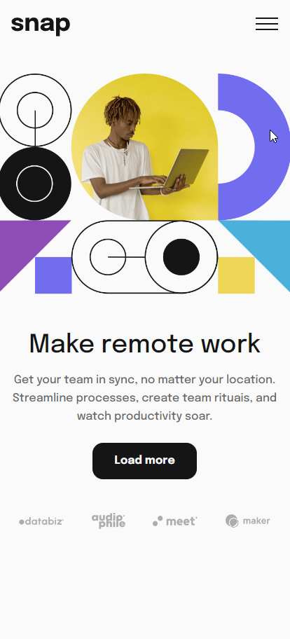
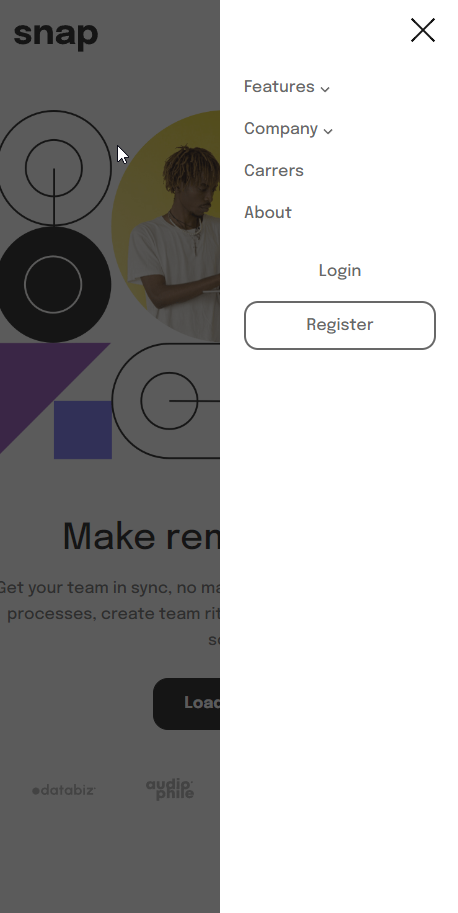
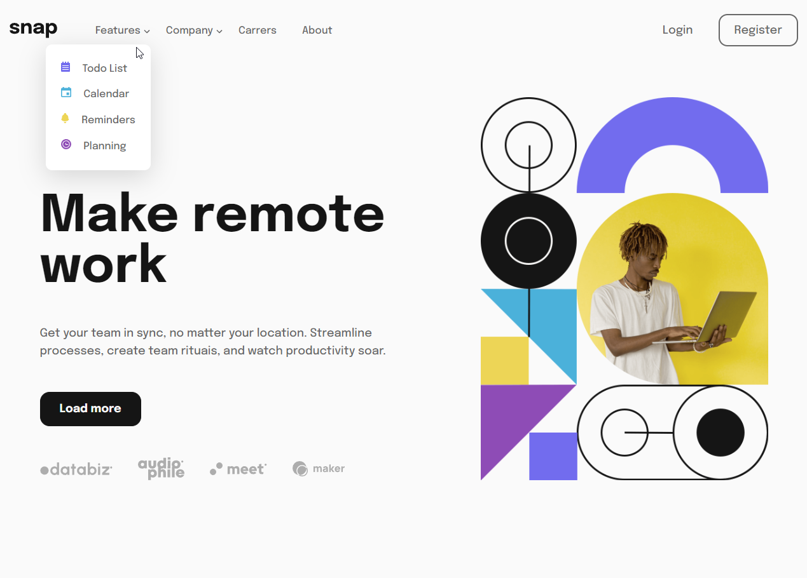

# Frontend Mentor - Intro section with dropdown navigation solution

This is a solution to the [Intro section with dropdown navigation challenge on Frontend Mentor](https://www.frontendmentor.io/challenges/intro-section-with-dropdown-navigation-ryaPetHE5). Frontend Mentor challenges help you improve your coding skills by building realistic projects. 

## Table of contents

- [Overview](#overview)
  - [The challenge](#the-challenge)
  - [Screenshot](#screenshot)
  - [Links](#links)
- [My process](#my-process)
  - [Built with](#built-with)
  - [What I learned](#what-i-learned)
- [Author](#author)

## Overview

### The challenge

Users should be able to:

- View the relevant dropdown menus on desktop and mobile when interacting with the navigation links
- View the optimal layout for the content depending on their device's screen size
- See hover states for all interactive elements on the page

### Screenshot





### Links

- Live Site URL: [Add live site URL here](https://your-live-site-url.com)

## My process

### Built with

- Semantic HTML5 markup
- CSS custom properties
- Flexbox
- CSS Grid
- JavaScript
- Vite

### What I learned
I learned how to animated dropdown (and it's consequences...)

```html
<li class="nav__item relative">
  <button class="dropdown__btn" data-target="#company-dropdown">
    Company
  </button>

  <ul class="dropdown" style="right: -3rem" id="company-dropdown" tabindex="-1">
    <li class="dropdown__item">
      <a class="dropdown__link" href="#">History</a>
    </li>
    <li class="dropdown__item">
      <a class="dropdown__link" href="#">Our team</a>
    </li>
    <li class="dropdown__item">
      <a class="dropdown__link" href="#">Blog</a>
    </li>
  </ul>
</li>
```
```css
.dropdown {
  display: flex;
  flex-direction: column;
  gap: 0.8rem;
  position: absolute;
  right: -1rem;
  margin-top: 0.5rem;
  padding: 1.5rem;
  border-radius: 10px;
  box-shadow: 0 10px 40px rgba(0, 0, 0, 0.1491);
  background-color: #fff;
  z-index: 1000;
  transform: scaleY(0);
  transition: transform 500ms ease;
}

.dropdown--open {
  transform: scaleY(1);
}
```
```js
const dropdownToggles = document.querySelectorAll('.dropdown__btn')
const dropdowns = document.querySelectorAll('.dropdown')

console.log(dropdownToggles)
console.log(dropdowns)

dropdownToggles.forEach(toggle => {
  toggle.addEventListener('click', () => {
    const target = toggle.getAttribute('data-target')
    const targetElement = document.querySelector(target)

    targetElement.classList.toggle('dropdown--open')
    targetElement.focus()
  })
})

dropdowns.forEach(dropdown => {
  dropdown.addEventListener('focusout', () => {
    setTimeout(() => {
      dropdown.classList.remove('dropdown--open')
    }, 650)
  })
})
```

I also learned how to "Add" a side mobile navbar on mobile views without having to write more HTML

``html
<ul class="nav__list">
  <button class="btn btn-close">
    
  </button>
  <li class="nav__item relative">
    <button class="dropdown__btn" data-target="#features-dropdown">
      Features
    </button>
    <ul class="dropdown" id="features-dropdown" tabindex="-1">
      <li class="dropdown__item" style="--icon-url: url('/vectors/icon-todo.svg')">
        <a class="dropdown__link" href="#">Todo List</a>
      </li>
      <li class="dropdown__item" style="--icon-url: url('/vectors/icon-calendar.svg')">
        <a class="dropdown__link" href="#">Calendar</a>
      </li>
      <li class="dropdown__item" style="--icon-url: url('/vectors/icon-reminders.svg')">
        <a class="dropdown__link" href="#">Reminders</a>
      </li>
      <li class="dropdown__item" style="--icon-url: url('/vectors/icon-planning.svg')">
        <a class="dropdown__link" href="#">Planning</a>
      </li>
    </ul>
  </li>
  <li class="nav__item relative">
    <button class="dropdown__btn" data-target="#company-dropdown">
      Company
    </button>
    <ul class="dropdown" style="right: -3rem" id="company-dropdown" tabindex="-1">
      <li class="dropdown__item">
        <a class="dropdown__link" href="#">History</a>
      </li>
      <li class="dropdown__item">
        <a class="dropdown__link" href="#">Our team</a>
      </li>
      <li class="dropdown__item">
        <a class="dropdown__link" href="#">Blog</a>
      </li>
    </ul>
  </li>
  <li class="nav__item">
    <a href="#" class="nav__link">Carrers</a>
  </li>
  <li class="nav__item">
    <a href="#" class="nav__link">About</a>
  </li>
  <li class="nav__item nav__item--separate">
    <button class="btn">Login</button>
  </li>
  <li class="nav__item">
    <button class="btn btn-outline">Register</button>
  </li>
</ul>
```

```css
.nav__list {
  display: flex;
  gap: 2.5rem;
  align-items: center;
  width: 100%;
}

.nav__item--separate {
  margin-left: auto;
}

.mobile-menu-toggle {
  display: none;
  cursor: pointer;
}

.btn-close {
  display: none;
}

@media only screen and (max-width: 768px) {
  .nav {
    display: flex;
    justify-content: space-between;
    align-items: center;
  }

  .mobile-menu-toggle {
    margin-bottom: 0.6rem;
  }

  .nav__list {
    position: absolute;
    top: 0;
    right: 0;
    min-height: 100vh;
    background-color: #fff;
    max-width: 15rem;
    flex-direction: column;
    align-items: start;
    padding: 1.5rem;
    display: none;
    z-index: 1000;
  }

  .layover--show {
    content: '';
    position: absolute;
    top: 0;
    left: 0;
    width: 100vw;
    min-height: 100vh;
    background-color: var(--black);
    opacity: 0.7;
    z-index: 10;
  }

  .nav__list--show {
    display: block;
  }

  .nav__item {
    width: 100%;
    margin-bottom: 1rem;
  }

  .nav__item--separate {
    margin-top: 2rem;
  }

  .nav__list .btn {
    width: 100%;
  }

  .mobile-menu-toggle {
    display: block;
  }

  .btn.btn-close {
    display: block;
    width: max-content;
    margin-left: auto;
    margin-bottom: 2rem;
  }
}
```

```js
const navbar = document.querySelector('.nav__list')
const layover = document.querySelector('.layover')
const mobileNavToggler = document.querySelector('.mobile-menu-toggle')
const closeButton = document.querySelector('.btn-close')

mobileNavToggler.addEventListener('click', () => {
  navbar.classList.toggle('nav__list--show')
  layover.classList.toggle('layover--show')
})

closeButton.addEventListener('click', () => {
  navbar.classList.remove('nav__list--show')
  layover.classList.remove('layover--show')
})
```

## Author

- Website - [Wellington Damasio](https://wellingtondamasio.com)
- Frontend Mentor - [@wellington-damasio](https://www.frontendmentor.io/profile/wellington-damasio)
